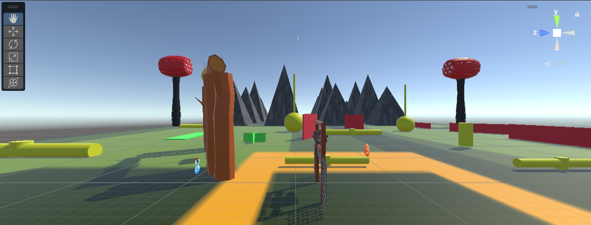
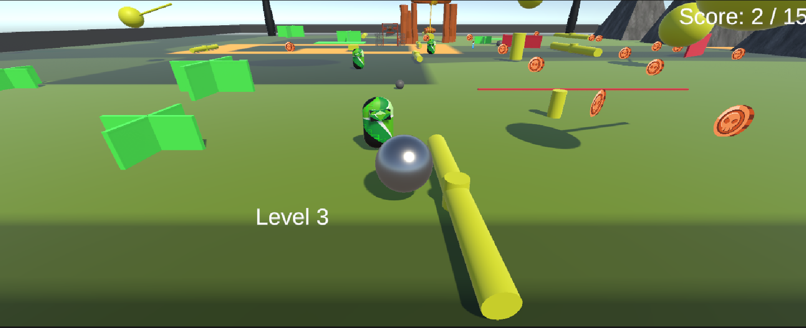
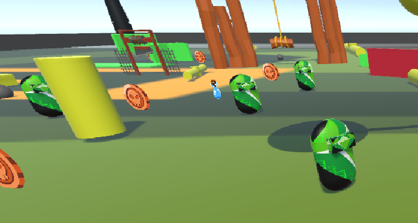
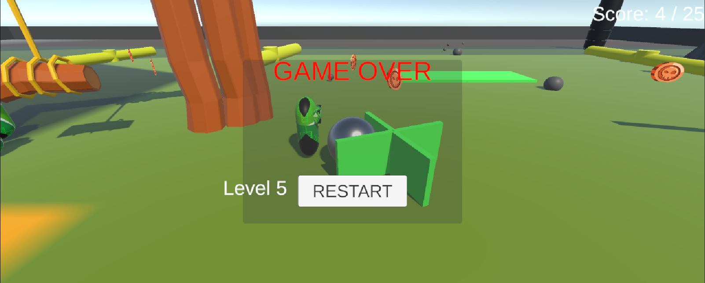

# Coin Collector 3D – Unity Game

A fast-paced 3D coin-collecting game with increasing difficulty, speed potions, chasing enemies, and level progression.

---

## Features

- **Player Movement**: WASD + Space to jump
- **Collect Coins**: 5 × current level to win
- **Speed Potions**: Temporary speed boost
- **Enemies**: Spawn from Level 2+, chase the player
- **Fall Detection**: Fall off the map → lose and drop a level
- **Level System**: 10 levels, progress saved via `PlayerPrefs`
- **Dynamic Environment**: Trees, rocks, boundaries, fog

---

## How to Play

1. Move with **WASD**
2. **Jump** with **Space**
3. Collect **bronze coins** to reach the score
4. Grab **potions** for speed boost
5. Avoid **enemies** and falling off the edge
6. Win the level → go to next
7. Lose → drop one level

---

## Screenshots

| Gameplay Overview | Level 3 – Coin Collection |
|--------------------|----------------------------|
|  |  |
| *Low-poly environment with obstacles, trees, and floating coins* | *Player collecting coins while avoiding enemies* |

| Enemies & Potions | Game Over Screen |
|-------------------|------------------|
|  |  |
| *Green enemies chase the player; blue potion gives speed boost* | *Lose screen with Restart button and current level* |

---

## Required Assets

This project uses free/large asset packs from the Unity Asset Store (excluded from Git to keep the repo <100MB). Import them into your Unity project before running:

- **POLY STYLE - Platformer Starter Pack**: https://assetstore.unity.com/packages/3d/environments/poly-style-platformer-starter-pack-284167
- **Free Game Items**: https://assetstore.unity.com/packages/2d/environments/free-game-items-131764
- **Obstacle Course Pack**: https://assetstore.unity.com/packages/templates/packs/obstacle-course-pack-178169
- **Obstacle Pack**: https://assetstore.unity.com/packages/3d/props/low-poly-obstacle-pack-303082
- **Abandoned World – Modular Abandoned Depot**: https://assetstore.unity.com/packages/3d/environments/industrial/modular-abandoned-depot-207432
- **Tree_Textures** (Generated via Unity Tree Creator)
- **TextMesh Pro** (Install via Package Manager)

After importing, ensure prefabs such as *treePrefab* and *rockPrefab* are assigned in `GameEnvironment.cs`.

Total download size: ~2GB+.

---

## Project Structure
```
Assets/
├── Scripts/
│   ├── mvBal.cs            → Player movement & jump
│   ├── CoinCollector.cs    → Coin pickup logic
│   ├── CoinSpawner.cs      → Spawns coins
│   ├── PotionCollector.cs  → Speed potion effect
│   ├── PotionSpawner.cs    → Spawns potions every 10s
│   ├── EnemyFollow.cs      → AI chases player
│   ├── ScoreManager.cs     → Level, score, win/lose
│   ├── CameraFollow.cs     → Smooth 3rd-person camera
│   ├── GameEnvironment.cs  → Procedural environment
│   ├── EnvironmentSetup.cs → Ground and props setup
│   └── CoinRotation.cs     → Coin rotation effect
├── Prefabs/
│   ├── Player.prefab
│   ├── coin prefab.prefab
│   ├── SpeedPotion.prefab
│   └── Enemy.prefab
├── Materials/
│   ├── plane.mat
│   └── ball.mat
├── Scenes/
│   └── MainScene.unity
└── [Imported Packs]/
    ├── Abandoned World/
    ├── Free Game Items/
    ├── Obstacle Pack/
    ├── ObstacleCoursePack/
    ├── POLY STYLE - Platformer Starter Pack/
    ├── TextMesh Pro/
    └── Tree_Textures/
```

---

## Setup & Run (Unity)

1. **Clone the Repo**: `git clone https://github.com/yourname/coin-collector-3d.git`
2. **Import Required Assets**
3. Open the project in **Unity 2021.3 LTS or newer**
4. Open the scene: `Assets/Scenes/MainScene.unity`
5. Assign prefabs in **ScoreManager**:
   - Player
   - Enemy Prefab
   - Coin Prefab
   - Potion Prefab
6. Assign materials if needed
7. Assign **TextMeshPro** UI elements
8. Assign panels for Lose + Level Complete
9. Press **Play**

---

## Build Instructions

1. Go to **File > Build Settings**
2. Add current scene
3. Select target platform
4. Click **Build**

---

## Git Usage

```bash
git init
git add .
git commit -m "Initial commit: full game with environment, AI, scoring, potions"
git branch -M main
git remote add origin https://github.com/yourname/coin-collector-3d.git
git push -u origin main
```

After importing assets (not committed), add custom changes and commit.

---

## Scripts Overview

| Script | Purpose |
|--------|---------|
| mvBal.cs | Player physics, jump, speed boost |
| CoinCollector.cs | Trigger → add score → respawn |
| CoinSpawner.cs | Spawns N coins at start |
| PotionSpawner.cs | Spawns one potion every 10s |
| EnemyFollow.cs | AI follows player |
| ScoreManager.cs | Level logic, win/lose, save progress |
| CameraFollow.cs | Smooth 3rd‑person camera |
| GameEnvironment.cs | Procedural terrain, trees, rocks, sky |
| EnvironmentSetup.cs | Ground setup with boundaries and rocks |
| CoinRotation.cs | Rotates coins |
| PotionCollector.cs | Potion pickup + boost |

---

## Known Issues / TODO

- Add particle effects on coin/potion pickup
- Add sound effects + background music
- Add mobile touch controls
- Improve enemy AI

---

## Credits

Made with Unity 2021.3+  
Uses TextMeshPro for UI  
Asset packs from Unity Asset Store (see Required Assets)

---

Have fun collecting coins!
